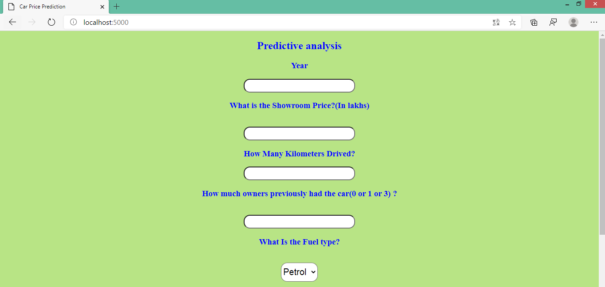

# Car_Price_Prediction
End to end Machine learning project to predict price of cars

We will first build a model using sklearn and random forest using car data from [&lt;kaggle.com&gt;](https://www.kaggle.com/nehalbirla/vehicle-dataset-from-cardekho). Second step would be to write a python flask server that uses the saved model to serve http requests. Third component is the website built in html, css and javascript that allows user to enter .....etc and it will call python flask server to retrieve the predicted price. During model building we will cover almost all data science concepts such as data load and cleaning, outlier detection and removal, feature engineering, dimensionality reduction, gridsearchcv for hyperparameter tunning, k fold cross validation etc. Technology and tools wise this project covers,
1) Python
2) Numpy and Pandas for data cleaning
3) Matplotlib for data visualization
4) Sklearn for model building
5) Jupyter notebook, visual studio code as IDE
6) Python flask for http server
7) HTML/CSS/Javascript for UI

